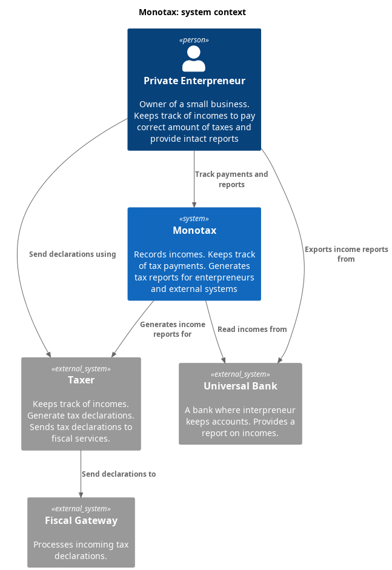
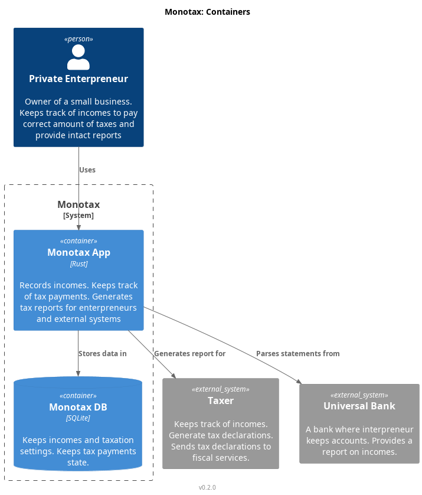
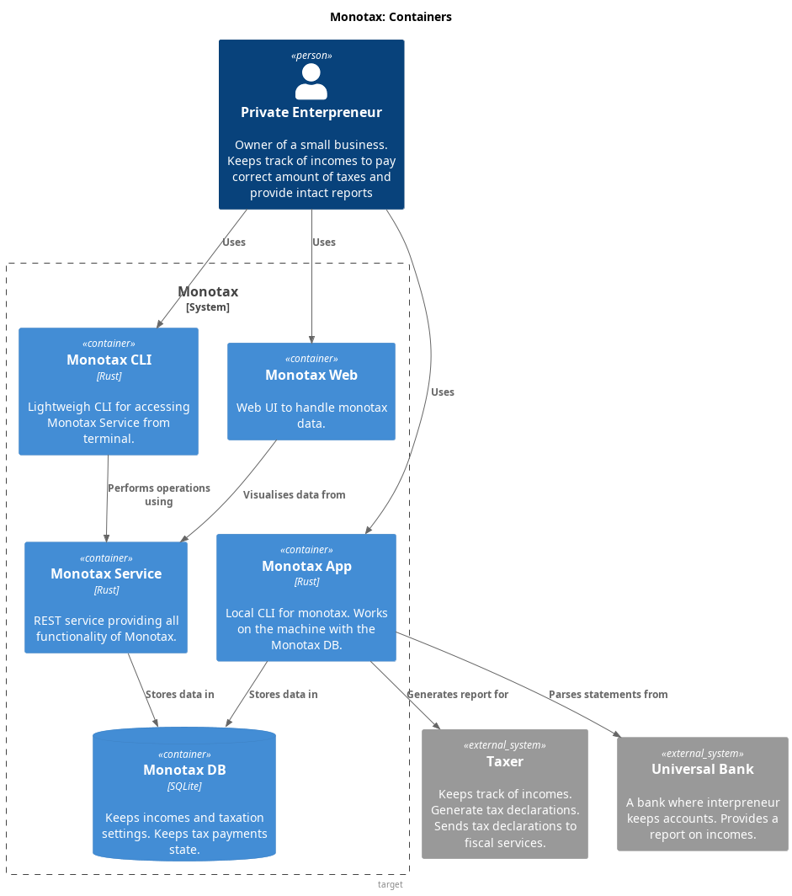

# Architecture

## Overview

Monotax is a set of utilities to help manage taxes. It keeps track of incomes and is able to generate reports and export data for specialized services.

## Goals and non-goals

Monotax is for personal use only. There are no plans to add multiple users support.

Minimal deployment infrastructure. Ideally there will be no requirement for external components other that the SQLite database.

The system should be usable over the network. While the initial development focuses on the local CLI, the complete solution will have REST interface. I have multiple machines, switching to a different one just to enter payment data is inconvenient.

It's a learning project. The primary objective is to explore Rust and its ecosystem. The secondary objective is to have a useful tool for managing taxes.

## Structure overview

This section shows containers and other structural components of the Monotax. It is split into current and target sections. The current section shows the state of a system at the time of writing. The target section shows the desired state.

### Current structure

Monotax is a monolityc CLI application written in Rust. It uses local SQLite database for storage.

### Target structure

The target structure is split into multiple components. The main application is a REST API server. It uses SQLite database for storage. The server is accessed by a CLI client and a web client.

The REST service is necessary to allow sending data from any machine. Usually, I use Windows machine to get account statement file. Switching to Linux only to import data is tedious.

The CLI client is convenient for entering data. Also it is the easiest thing to implement quickly.

The Web client is more suitable to filter and explore historical data. It is also more convenient to use on mobile devices.

> Alternatively, I could host the service on one of RPi servers I have and access via SSH. It requires two things.
>
> * Storing account statements in a location accessible by the server.
> * Compiling the service for ARM architecture. 